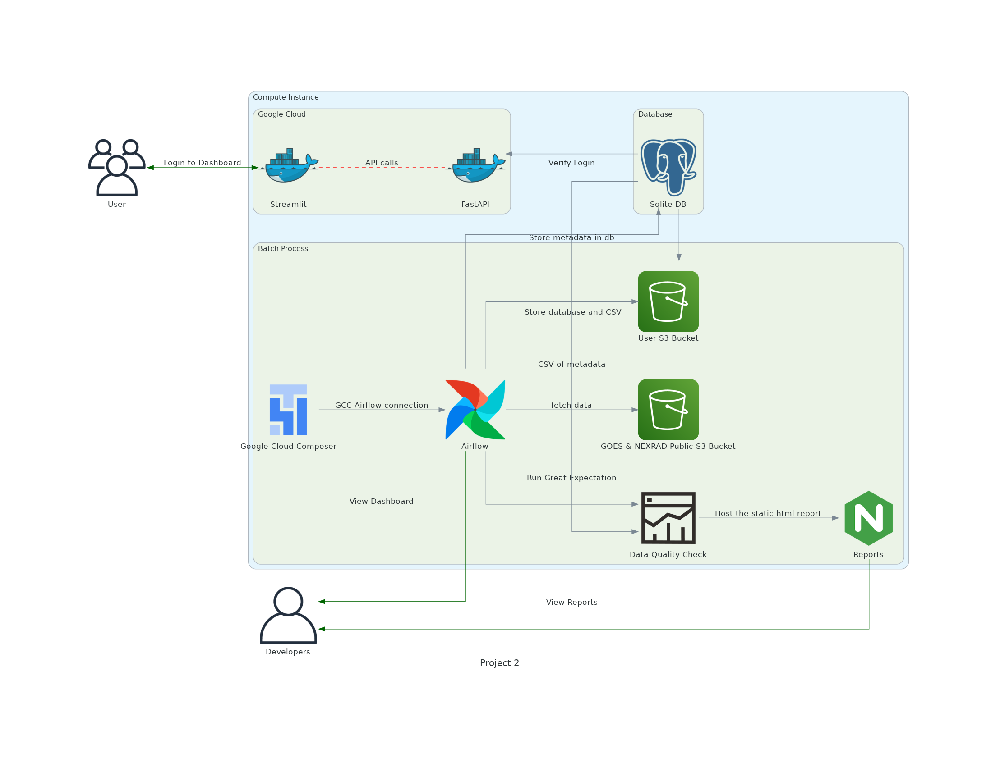

# Assignment_03: Data as a Service

> [Application Link](http://54.88.51.70:8501/login) <br>
> [Codelabs Documentation](https://codelabs-preview.appspot.com/?file_id=1zG832dq7KBnSKgSkrVcLHVQBfarUR8ALQIqqGmswVhE#4)<br>
> [FastAPI Docs](http://54.88.51.70:8000/docs) <br>
> Docker Images: [Backend](https://hub.docker.com/r/subhashchandran/assignment-03-fastapi),[Frontend](https://hub.docker.com/r/subhashchandran/assignment-03-streamlit) <br>
> [Python Package](https://pypi.org/project/typernexrad-cli/0.1.0/) <br>


## Objective 

The primary objective is to create a platform to provide data retrieval service for satellite images in NOAA’s GOES18 and Nexrad AWS S3 buckets. A user can either provide input for image-related attributes or directly provide a filename to generate a link to the file.

## Usecase

- A user can fetch the data either by providing date and station features or by providing a valid file name
- A downloadable link to the file is provided for both NOAA’s and Private buckets
- A plot for all NEXRAD stations across the US

**Note:** The data is scrapped from publicly accessible data in NOAA’s S3 buckets and is refreshed daily with Airflow DAGs

## Tech Components

- Backend - FastAPI, Airflow, AWS Cloudwatch
- Frontend UI - Streamlit 
- Deployment - Docker + AWS EC2, Typer CLI

## Architecture Diagram


## Backend - FastAPI, Airflow, AWS Cloudwatch

The backend is designed in a way that it facilitates API calls for communication between Frontend and the Backend. The RestAPIs developed with FASTAPI are restricted with JWTAuthentication through which a token is generated with an expiry of 30mins for every new user. The major operations are - 
- User retrieval and creation
- Token authentication
- Query data from the database as demanded
- User activity tracking and API usage limitation
- File source URL generation

## Frontend - Streamlit

The UI was developed with the help of the python library of Streamlit framework. The application follows the following flow - 

- User Login for existing users, or Sign up for new users
- Once logged in there are five modules that the user can access - 
  - Goes - Feature-based file extraction for Goes18 
  - Goes file link - File name based url generation for Goes18
  - Nexrad - Feature-based file extraction for Nexrad
  - Nexrad file link - File name based url generation for Nexrad
  - Nexrad plot - Plot of all Nexrad stations in the United States
- User Dashboard - To track activity and remaining API hits displaying - 
  - Active plan
  - Used balance with the remaining limit
  - Charts for API usage based on modules and overall at multiple timeframes
- Logout - To exit the app
- Admin Dashboard - To track all activity of the application 
  - All users displayed based on the plan
  - Multiple charts showcasing API usage across multiple timeframes

## Deployment - Docker + AWS EC2, Typer CLI

- Both the backend and frontend are individually containerized using docker. Then docker-compose is used to bind the two containers and are deployed on the AWS EC2 instance
- The application can also be used through the terminal by installing the wheel package we have created. 
- The usage activity is logged in AWS Cloudwatch and we have created a module for unit testing using the python library ‘Pytest’.  

## Steps to run the application - 

- Clone repository 
- Create .env file with AWS Bucket and Logging credentials. Format to follow (access token automatically generates with login, but variable should be there) -
```
AWS_LOG_ACCESS_KEY= <enter your Log access Key>
AWS_LOG_SECRET_KEY= <enter your Log secret Key>

AWS_ACCESS_KEY1 = <enter your AWS access Key>
AWS_SECRET_KEY1 = <enter your AWS secret Key>

access_token=
 ```
- Execute the docker compose file (docker-compose.yml) with the command ‘docker compose up’

#### Attestation
WE ATTEST THAT WE HAVEN’T USED ANY OTHER STUDENTS WORK IN OUR ASSIGNMENT AND ABIDE BY THE POLICIES LISTED IN THE STUDENT HANDBOOK

Contribution:
- Dhanush Kumar Shankar: 25%
- Nishanth Prasath: 25%
- Shubham Goyal: 25%
- Subhash Chandran Shankarakumar: 25%
